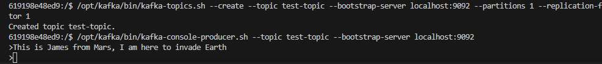
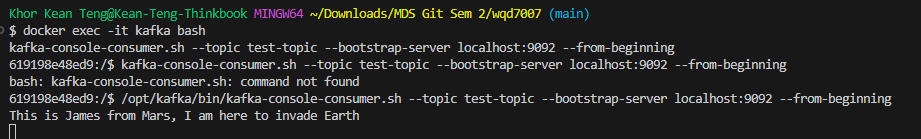

# Kafka Reference

## Configuration

Load the Kafka image to Docker and start the container with the following command:

```bash
# Load the Kafka image
docker pull apache/kafka:4.0.0

# Start the Kafka container
docker run -d --name kafka -p 9092:9092 apache/kafka:4.0.0

# Access the container terminal
docker exec -it kafka bash
```

## Working with Kafka

Firstly, find where the scripts files are located in the container:

```bash
find / -name "*.sh" | grep kafka

# normally in
/opt/kafka/bin
```

Then, create a test topic:

```bash
/opt/kafka/bin/kafka-topics.sh --create --topic test-topic --bootstrap-server localhost:9092 --partitions 1 --replication-factor 1
```

Start a producer and a consumer:

```bash
# Start a producer
/opt/kafka/bin/kafka-console-producer.sh --topic test-topic --bootstrap-server localhost:9092
```



On another terminal, start a consumer:

```bash
docker exec -it kafka bash
/opt/kafka/bin/kafka-console-consumer.sh --topic test-topic --bootstrap-server localhost:9092 --from-beginning
```

