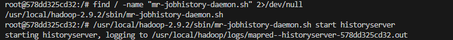
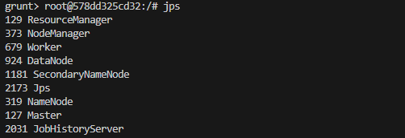
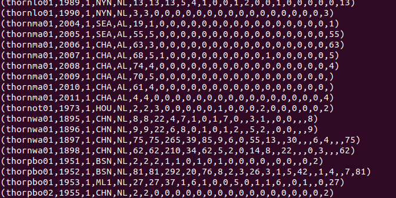

# Pig Reference

## Configuration

Start Docker and pull the images. Then run the container to access Pig via terminal:

```bash
# pull the image
docker pull suhothayan/hadoop-spark-pig-hive:2.9.2

# start the container and mount the local directory as a volume
docker run -it -p 50070:50070 -p 8088:8088 -p 8080:8080 -v "//c/Users/Khor Kean Teng/Downloads/MDS Git Sem 2/wqd7007/docker/pig:/data2" suhothayan/hadoop-spark-pig-hive:2.9.2 bash

# verify if the volume is mounted
ls /data2
```

To avoid Pig facing connection issues, we need to enable the `historyserver` in Hadoop cluster. 



```bash
# find the shell script to start the history server
find / -name "mr-jobhistory-daemon.sh" 2>/dev/null

# start the history server
/usr/local/hadoop-2.9.2/sbin/mr-jobhistory-daemon.sh start historyserver
```

The picture shows the `historyserver` is running.



## Working with Pig

First we need to load the data into HDFS before we can use it on Pig.

```bash
hadoop fs -mkdir /user/hdfs
hadoop fs -put /data2/Batting.csv /user/hdfs/batting.csv

# check if the file is uploaded
hadoop fs -ls /user/hdfs
```



```bash
batting = load '/user/hdfs/batting.csv' using PigStorage(',');
raw_runs = FILTER batting BY $1>0;

# view the raw_runs
DUMP raw_runs;

# filter data
Runs = FOREACH raw_runs GENERATE $0 as playerID, $1 as year, $8 as runs;

# view the Runs
DUMP Runs;

# aggregate data
grp_data = GROUP Runs by (year);
max_runs = FOREACH grp_data GENERATE group as 
grp,MAX(Runs.runs) as max_runs;
DUMP max_runs

# join data
join_max_run = JOIN max_runs by ($0, max_runs), 
runs by (year, runs);
join_data = FOREACH join_max_run GENERATE $0 as 
year, $2 as playerID, $1 as run.
DUMP join_data
```

## Further Example

Load the `movies_data.csv` file into HDFS

```bash
hadoop fs -put /data2/movies_data.csv /user/hdfs/movies_data.csv
hadoop fs -ls /user/hdfs
```

Working with the data on Pig:

```bash
# load the data
movies = LOAD '/user/hdfs/movies_data.csv'using PigStorage(',') as (id, name, year, rating, duration);
DUMP movies

# find movies rating more than 4
movies_greater_than_four = FILTER movies BY (float)rating>4.0;
DUMP movies_greater_than_four

# write the outcome to persistent storage
STORE movies_greater_than_four INTO '/user/hdfs/movies_greater_than_four';

# look for classic movies between 1950 and 1960
movies_between_50_60 = FILTER movies by year>1950 and year<1960;

# write the outcome to persistent storage
STORE movies_between_50_60 INTO '/user/hdfs/movies_between_50_60';

# retrieve movie start with character "A"
movies_starting_with_A = FILTER movies by name matches 'A.*';

# write the outcome to persistent storage
STORE movies_starting_with_A INTO '/user/hdfs/movies_starting_with_A';
```

Now, let's load the processed data from HDFS to local directory:

```bash
hadoop fs -get /user/hdfs/movies_greater_than_four /data2/output/movies_greater_than_four
hadoop fs -get /user/hdfs/movies_between_50_60 /data2/output/movies_between_50_60
hadoop fs -get /user/hdfs/movies_starting_with_A /data2/output/movies_starting_with_A
```

We can then see that the files are downloaded to the local directory `/data2/output/`. Make sure we are at `/` directory before running the following command:

```bash
# For movies_greater_than_four
echo "id,name,year,rating,duration" > /data2/output/movies_greater_than_four.csv
cat /data2/output/movies_greater_than_four/part-* >> /data2/output/movies_greater_than_four.csv

# For movies_between_50_60
echo "id,name,year,rating,duration" > /data2/output/movies_between_50_60.csv
cat /data2/output/movies_between_50_60/part-* >> /data2/output/movies_between_50_60.csv

# For movies_starting_with_A
echo "id,name,year,rating,duration" > /data2/output/movies_starting_with_A.csv
cat /data2/output/movies_starting_with_A/part-* >> /data2/output/movies_starting_with_A.csv
```