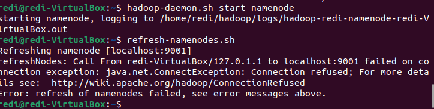

# Lab 3 Part 2 Documentation

- Date: April 22, 2025
- Platform: Oracle Quick VM

## Setup
Follow the slide, part 2 will work with Sqoop. Remember username is `redi` and password is `1234`.

## Configuration

Download the `tar.gz` file from here https://archive.apache.org/dist/sqoop/1.4.7/. Select the `hadoop-2.6.0` one.

Then unzip the file. Can use the code or do in file explorer:
```bash
# Better use file explorer
tar -xzf sqoop-1.4.7.bin__hadoop-2.6.0.tar.gz
```

Then create `sqoop` folder at `home` directory and paster everything inside. Then update the environment variables by inserting the variables at the last line:

```bash
nano ~/.bashrc

# version 1
export PATH=$PATH:/home/redi/sqoop/bin
# version 2
export SQOOP_HOME=/home/redi/sqoop # redi is the username
export PATH=$PATH:$SQOOP_HOME/bin

source ~/.bashrc
```

Then update the template file. First make a copy of `/home/redi/sqoop/conf/sqoop-env-template.sh` and rename to `/home/redi/sqoop/conf/sqoop-env.sh`. Then update the content:

```bash
# remember to remove the comment tag
export HADOOP_COMMON_HOME=/home/student/hadoop
export HADOOP_MAPRED_HOME=/home/student/hadoop
```

Then copy the MySQL connector from Spectrum (can be downloaded at the `/jar` of this repo) and paste to `home/redi/sqoop/lib`. Then, run the command:

```bash
# THIS CODE
sqoop import -connect 
jdbc:mysql://localhost/WQD7007 -username 
root -password 1234 -table churn -m 1
```

## Issues (Resolved) 💡

Currently, the MapReduce process cannot be completed and will stuck at 0%, although the nodes are working at `localhost:8088`. Further investigation is needed.

**Attempt**
- Increase memory of `yarn`, still not working
- Install hadoop-3.2.4, not working as Scoop does not support hadoop version 3. (See the trouble I went through below👇)

## Solution
MapReduce process stucking at 0% was caused by `namenode` and `datanode` not start up, thus the MapReduce process cannot be completed. To properly resolve them, we first need stop all the running process by typing `stop-all.sh`.

Then create `/data` folder at `hadoop/data`. Then create `namenode` and `datanode` folder inside `hadoop/data`. Then update `hadoop/etc/hdfs-site.xml`

```html
// change username
<property>
  <name>dfs.replication</name>
  <value>3</value>
</property><property>
  <name>dfs.name.dir</name>
  <value>/home/redi/hadoop/data/namenode</value>
</property><property>
  <name>dfs.data.dir</name>
  <value>/home/redi/hadoop/data/datanode</value>
</property>
```

After that run `hadoop namenode -format` and `start-all.sh` to check if Namonode and DataNode is running. It would be a inconvenience to type password for authentication everytime, to auto authenticate type:

```bash
# SSH Key Configure
ssh-keygen -t rsa
# replace id_rsa as authorized keys
cat ~/.ssh/id_rsa.pub >> ~/.ssh/authorized_keys
# add read and write access
chmod 640 ~/.ssh/authorized_keys
```

We can type `jps` to see if all the process is running:


If the process is running, then we can try to load the data and run the MapReduce process:

```bash
sqoop import -connect 
jdbc:mysql://localhost/WQD7007 -username 
root -password 1234 -table churn -m 1 # change password
```

If the code executed successfully, we can view them at `hdfs dfs -cat /churn_2/*`. Then the output as follows. Note you need to check where is the output folder as sometimes it can be at `user/redi/churn`:


## The Trouble ｜大変でした
After seeing MapReduce stucked at 0%, various attemp has been applied like using a different version of hadoop, changing the resource configuration where I saw online that it could be not enough resources allocation. Clearly that did not work and it caused me some trouble later. Even on `hadoop-3.2.4` I notice that the Namenode is not working which is the main culprit: 



Since there is some conflict between Sqoop and hadoop-3.2.4, I am forced to switch back to hadoop-2.7.7 where sqoop is supported. I am almost giving up since datanode and namenode does not start up where I try changing the port, localhost name and restarting for a lot of times but I found that on Stack Overflow, we can check the logs at `hadoop/logs` and I found that there is actually some conflicts between the file path where I forgot to change the username on `hdfs-site.xml`. That resolves the issue but datanode is still dead after the fix. However, fixing the datanode turns out to be easy although I do face like ID mismatch error between namenode and datanode along the way that can be resolved by:

```bash
hadoop datanode -format --force
hadoop namenode -format --force
start-dfs.sh
```

Once I get datanode and namenode running, another problem appears where the MapReduce process fail, this is caused by running hadoop-3.2.4 earlier thus I have to shut them down using `sudo kill -9 <process_number>`. 

After shutting down the unwanted process from another version of hadoop. The program runs successfully. Along the way I also encountered issue like missing resource-manager, and so on. Importantly, always check `jps` before doing anything as we need a whole cluster to be available for the tasks to be completed.

## Bug Fixes

- Typo `locahost` should be modified to `localhost` at `yarn-site.xml` as it will result in an empty and inaccesible node to be called
- `namenode` not starting or `resource-manager` not appearing in `sudo jps` is detected. To resolve we need to restart everything via:
```bash
hadoop/sbin/start-all.sh
hadoop/sbin/stop-all.sh
# check localhost to see if hadoop is running
```
- When booting the VM the screen is also detected to be freeze, this is resolved by powering down the machine. Powering down the machine will not delete the machine data and it can be a useful approach in certain scenario.

**MySQL Issue**
```bash
# THIS CODE
sqoop import -connect 
jdbc:mysql://localhost/WQD7007 -username 
root -password 1234 -table churn -m 1 # change password
```
- When the code is run a `/churn` folder will be created at hadoop, and running it for a second time will result in an error where a folder exists, we can remove the created folder with:
```bash
# delete folder
hdfs dfs -rm -r /home/redi/churn

# check folder note that /home/redi is created by default
# like we create /abc
# then if will be put at /home/redi/abc
hdfs dfs -ls /home/redi
```
