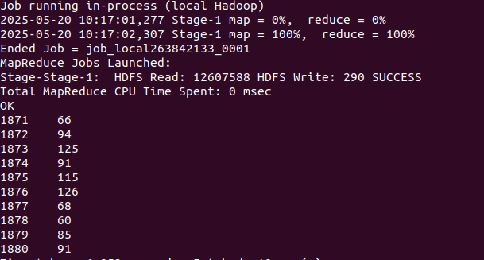
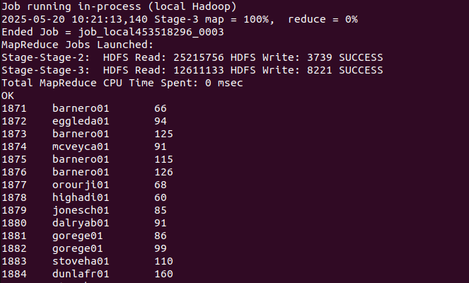

# Lab 4 Documentation

- Date: May 20, 2025
- Platform: Oracle Quick VM

## Setup
Refer to lecture slides for setting up the environment. The following steps are a summary of the setup process.

## Configuration

Download the `apache-hive-2.1.0-bin.tar.gz` from [here](https://archive.apache.org/dist/hive/hive-2.1.0/), download and unzip the file using file explorer. Then copy or move the content to `home/redi/hive` directory. 

```bash
cd /home/redi
mkdir hive
copy -r /home/redi/Downloads/apache-hive-2.1.0-bin/* /home/redi/hive
```

Then update the `.bashrc` file to include the following lines:

```bash
export PATH=$PATH:/home/redi/hive/bin
```

After that, run the following command to update the environment variables:

```bash
source ~/.bashrc
```

## Setting Up Hive

Go to `hive/bin` and then add the following line to `hive-config.sh`L

```bash
cd hive/bin
nano hive-config.sh

# add this
export HADOOP_HOME=/home/redi/hadoop
```

Then create Hadoop warehouse:

```bash
hadoop fs -mkdir hive
hadoop fs -mkdir hive/warehouse
hadoop fs -chmod 765 hive/warehouse
```

Then run the following code and you should see the hive terminal appearing:

```bash
# go to the bin
cd hive/bin
./schematool-initSchema-dbType derby

# run the hive
hive
```

## Working With Hive

Testing some sample examples:

```bash
create database wqd7007;
show databases;
exit;
```

Add the `Battling.csv` file:

```bash
CREATE DATABASE IF NOT EXISTS wqd7007;
USE wqd7007;

CREATE TABLE IF NOT EXISTS batting (
    playerID STRING,
    yearID INT,
    stint INT,
    teamID STRING,
    lgID STRING,
    G INT,
    G_batting INT,
    AB INT,
    R INT,
    H INT,
    `2B` INT,  -- Using backticks as 2B starts with a number
    `3B` INT,
    HR INT,
    RBI INT,
    SB INT,
    CS INT,
    BB INT,
    SO INT,
    IBB INT,
    HBP INT,
    SH INT,
    SF INT,
    GIDP INT,
    G_old INT
) 
ROW FORMAT DELIMITED 
FIELDS TERMINATED BY ',' 
TBLPROPERTIES("skip.header.line.count"="1");

LOAD DATA LOCAL INPATH '../../Downloads/baseball.csv' 
OVERWRITE INTO TABLE batting;

SELECT * FROM batting LIMIT 10;
```

After running the above code, we should see the data being outputted. Now let's try some more complex queries involving map-reduce:

> If we type wrong the columns name, the map reduce will get stuck

```bash
SELECT yearID, max(R) FROM batting GROUP BY yearID LIMIT 10;
```



```bash
SELECT a.yearID, a.playerID, a.R 
FROM batting a
JOIN (
    SELECT yearID, MAX(R) as max_runs 
    FROM batting 
    GROUP BY yearID
) b ON (a.yearID = b.yearID AND a.R = b.max_runs)
```


