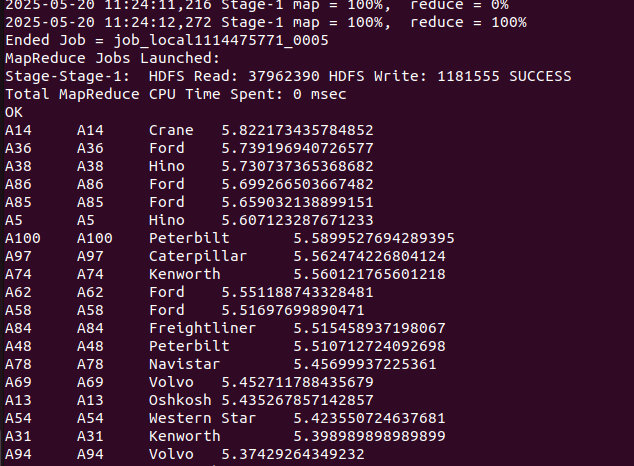
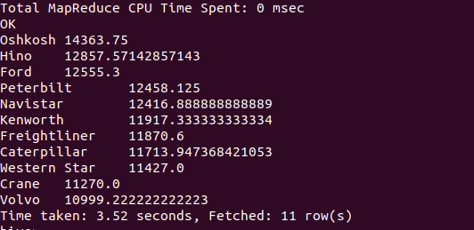
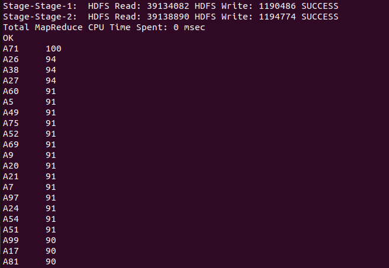
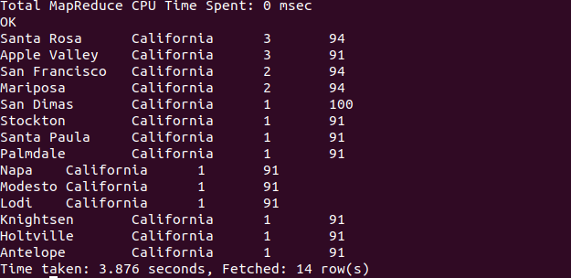

# Lab 4 Part 2 Documentation

- Date: May 20, 2025
- Platform: Oracle Quick VM

## Setup
Refer to lecture slides for setting up the environment. The following steps are a summary of the setup process. Can refer to [Lab 4 Part 1 Documentation](https://github.com/keanteng/wqd7007/blob/main/labs/lab_4_1.md) for the setup of the environment.

## Exercises

Load the `geolocation.csv` and `trucks.csv` into hive for further analysis.

```bash
# geolocation.csv
CREATE TABLE geolocation (
    truckid STRING,
    driverid STRING,
    event STRING,
    latitude DOUBLE,
    longitude DOUBLE,
    city STRING,
    state STRING,
    velocity INT,
    event_ind INT,
    idling_ind INT
)
ROW FORMAT DELIMITED
FIELDS TERMINATED BY ','
STORED AS TEXTFILE
TBLPROPERTIES("skip.header.line.count"="1");

LOAD DATA LOCAL INPATH '../../Downloads/geolocation.csv' 
INTO TABLE geolocation;
```

```bash
# trucks.csv
CREATE TABLE trucks (
    driverid STRING,
    truckid STRING,
    model STRING,
    jun13_miles INT, jun13_gas INT,
    may13_miles INT, may13_gas INT,
    apr13_miles INT, apr13_gas INT,
    mar13_miles INT, mar13_gas INT,
    feb13_miles INT, feb13_gas INT,
    jan13_miles INT, jan13_gas INT,
    dec12_miles INT, dec12_gas INT,
    nov12_miles INT, nov12_gas INT,
    oct12_miles INT, oct12_gas INT,
    sep12_miles INT, sep12_gas INT,
    aug12_miles INT, aug12_gas INT,
    jul12_miles INT, jul12_gas INT,
    jun12_miles INT, jun12_gas INT,
    may12_miles INT, may12_gas INT,
    apr12_miles INT, apr12_gas INT,
    mar12_miles INT, mar12_gas INT,
    feb12_miles INT, feb12_gas INT,
    jan12_miles INT, jan12_gas INT,
    dec11_miles INT, dec11_gas INT,
    nov11_miles INT, nov11_gas INT,
    oct11_miles INT, oct11_gas INT,
    sep11_miles INT, sep11_gas INT,
    aug11_miles INT, aug11_gas INT,
    jul11_miles INT, jul11_gas INT,
    jun11_miles INT, jun11_gas INT,
    may11_miles INT, may11_gas INT,
    apr11_miles INT, apr11_gas INT,
    mar11_miles INT, mar11_gas INT,
    feb11_miles INT, feb11_gas INT,
    jan11_miles INT, jan11_gas INT,
    dec10_miles INT, dec10_gas INT,
    nov10_miles INT, nov10_gas INT,
    oct10_miles INT, oct10_gas INT,
    sep10_miles INT, sep10_gas INT,
    aug10_miles INT, aug10_gas INT,
    jul10_miles INT, jul10_gas INT,
    jun10_miles INT, jun10_gas INT,
    may10_miles INT, may10_gas INT,
    apr10_miles INT, apr10_gas INT,
    mar10_miles INT, mar10_gas INT,
    feb10_miles INT, feb10_gas INT,
    jan10_miles INT, jan10_gas INT,
    dec09_miles INT, dec09_gas INT,
    nov09_miles INT, nov09_gas INT,
    oct09_miles INT, oct09_gas INT,
    sep09_miles INT, sep09_gas INT,
    aug09_miles INT, aug09_gas INT,
    jul09_miles INT, jul09_gas INT,
    jun09_miles INT, jun09_gas INT,
    may09_miles INT, may09_gas INT,
    apr09_miles INT, apr09_gas INT,
    mar09_miles INT, mar09_gas INT,
    feb09_miles INT, feb09_gas INT,
    jan09_miles INT, jan09_gas INT
)
ROW FORMAT DELIMITED
FIELDS TERMINATED BY ','
STORED AS TEXTFILE
TBLPROPERTIES("skip.header.line.count"="1");

LOAD DATA LOCAL INPATH '../../Downloads/trucks.csv' 
INTO TABLE trucks;
```

- Problem 1: Find out the truck, driver, truck model and their 
effective miles per gas in Jun13.

```sql
-- Calculate effective miles per gallon for June 2013
SELECT 
    truckid, 
    driverid, 
    model, 
    jun13_miles / jun13_gas AS jun13_mpg
FROM trucks
ORDER BY jun13_mpg DESC;
```



- Problem 2: Find the average miles on May 13 by truck model.

```sql
-- Calculate average miles in May 2013 grouped by truck model
SELECT 
    model,
    AVG(may13_miles) AS avg_may13_miles
FROM trucks
GROUP BY model
ORDER BY avg_may13_miles DESC;
```



- Problem 3: Find the drives who 'overspeed' using geolocation table.

```sql
-- Find drivers who overspeed (assuming overspeed is velocity > 65)
SELECT
    driverid,
    MAX(velocity) AS max_speed
FROM geolocation
WHERE velocity > 65  -- Assuming 65 is the speed limit
GROUP BY driverid
ORDER BY max_speed DESC;
```



- Problem 4: Find the cities where drivers overspeed.

```sql
-- Find cities where overspeeding occurs
SELECT 
    city,
    state,
    COUNT(*) AS overspeed_incidents,
    MAX(velocity) AS max_velocity
FROM geolocation
WHERE velocity > 65  -- Assuming 65 is the speed limit
GROUP BY city, state
ORDER BY overspeed_incidents DESC, max_velocity DESC;
```

