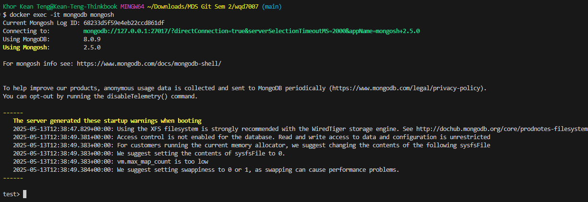

# MongoDB References

## Configuration

Pull the docker image and run the MongoDB container:
```bash
# Pull the MongoDB image
docker pull mongo

# normal run
docker run -d --name mongodb -p 27017:27017 mongo

# with volume
docker run -d --name mongodb -p 27017:27017 -v mongodb_data:/data/db mongo

# with authentication and volume
docker run -d --name mongodb \
  -p 27017:27017 \
  -e MONGO_INITDB_ROOT_USERNAME=admin \
  -e MONGO_INITDB_ROOT_PASSWORD=password \
  -v mongodb_data:/data/db \
  mongo

# launch a bash shell in the container
docker exec -it mongodb mongosh
```

Here it how the terminal will look like:



## MongoDB CRUD Operations Reference

This document provides examples of how to perform Create, Read, Update, and Delete (CRUD) operations in MongoDB using the terminal.

## Prerequisites

- MongoDB container running via Docker
- Access to `mongosh` (MongoDB Shell)

## Connection

### Connect to MongoDB Container
```bash
# Connect to MongoDB shell in container
docker exec -it mongodb mongosh
```

### Connect with Authentication
```bash
# If your MongoDB requires authentication
docker exec -it mongodb mongosh -u admin -p password --authenticationDatabase admin
```

## Database Operations

```javascript
// Show existing databases
show dbs

// Create/use a database
use sampleDB

// Check current database
db

// Drop current database
db.dropDatabase()
```

## Create Operations

### Insert a Single Document
```javascript
// Insert one document
db.users.insertOne({
  name: "John Doe",
  email: "john@example.com",
  age: 30,
  address: {
    street: "123 Main St",
    city: "Kuala Lumpur",
    country: "Malaysia"
  },
  interests: ["programming", "data science", "hiking"],
  created_at: new Date()
})
```

### Insert Multiple Documents
```javascript
// Insert multiple documents
db.users.insertMany([
  {
    name: "Jane Smith",
    email: "jane@example.com",
    age: 28,
    address: {
      street: "456 Park Ave",
      city: "Penang",
      country: "Malaysia"
    },
    interests: ["reading", "photography"],
    created_at: new Date()
  },
  {
    name: "Mike Johnson",
    email: "mike@example.com",
    age: 35,
    address: {
      street: "789 Broadway",
      city: "Johor Bahru",
      country: "Malaysia"
    },
    interests: ["cooking", "gaming"],
    created_at: new Date()
  }
])
```

## Read Operations

### Find All Documents
```javascript
// Find all documents in a collection
db.users.find()

// Format the output to be more readable
db.users.find().pretty()
```

### Find with Filtering Conditions
```javascript
// Find documents with specific criteria
db.users.find({ age: { $gt: 30 } })  // Users older than 30
db.users.find({ "address.city": "Kuala Lumpur" })  // Users from KL
db.users.find({ interests: "programming" })  // Users interested in programming
```

### Advanced Queries
```javascript
// AND condition
db.users.find({
  age: { $gte: 25, $lte: 35 },
  "address.country": "Malaysia"
})

// OR condition
db.users.find({
  $or: [
    { age: { $lt: 30 } },
    { "address.city": "Penang" }
  ]
})

// Count documents
db.users.countDocuments({ age: { $gt: 30 } })

// Limit results
db.users.find().limit(2)

// Skip and limit (pagination)
db.users.find().skip(1).limit(2)

// Sort results (1 for ascending, -1 for descending)
db.users.find().sort({ age: -1 }) // Sort by age descending
```

### Projection (Select Specific Fields)
```javascript
// Include only specific fields (1 = include)
db.users.find({}, { name: 1, email: 1, _id: 0 })

// Exclude specific fields (0 = exclude)
db.users.find({}, { address: 0, interests: 0 })
```

## Update Operations

### Update a Single Document
```javascript
// Update one document
db.users.updateOne(
  { name: "John Doe" },
  { $set: { age: 31, "address.street": "124 Main St" } }
)
```

### Update Multiple Documents
```javascript
// Update many documents
db.users.updateMany(
  { "address.country": "Malaysia" },
  { $set: { status: "active" } }
)
```

### Using Different Update Operators
```javascript
// Increment a value
db.users.updateOne(
  { name: "John Doe" },
  { $inc: { age: 1 } }
)

// Add to array
db.users.updateOne(
  { name: "John Doe" },
  { $push: { interests: "traveling" } }
)

// Remove from array
db.users.updateOne(
  { name: "Jane Smith" },
  { $pull: { interests: "reading" } }
)

// Update if exists, insert if not (upsert)
db.users.updateOne(
  { name: "Alex Wilson" },
  { $set: { age: 42, email: "alex@example.com" } },
  { upsert: true }
)
```

## Delete Operations

### Delete a Single Document
```javascript
// Delete one document
db.users.deleteOne({ name: "John Doe" })
```

### Delete Multiple Documents
```javascript
// Delete many documents
db.users.deleteMany({ age: { $lt: 30 } })

// Delete all documents in a collection
db.users.deleteMany({})
```

## Advanced Collection Operations

```javascript
// Create a collection explicitly
db.createCollection("products")

// List all collections in current database
show collections

// Rename a collection
db.users.renameCollection("people")

// Drop a collection
db.people.drop()

// Get collection statistics
db.users.stats()
```

## Aggregation Examples

```javascript
// Basic aggregation to group by city and count users
db.users.aggregate([
  { $group: { _id: "$address.city", count: { $sum: 1 } } }
])

// More complex aggregation with multiple stages
db.users.aggregate([
  { $match: { age: { $gt: 25 } } },
  { $group: { _id: "$address.city", avgAge: { $avg: "$age" }, count: { $sum: 1 } } },
  { $sort: { avgAge: -1 } }
])

// Using project to reshape documents
db.users.aggregate([
  { $project: { 
      fullName: "$name", 
      city: "$address.city",
      interestCount: { $size: "$interests" },
      _id: 0
    } 
  }
])
```

## Index Operations

```javascript
// Create a simple index
db.users.createIndex({ email: 1 })  // 1 for ascending order

// Create a compound index
db.users.createIndex({ "address.city": 1, age: -1 })

// Create a unique index
db.users.createIndex({ email: 1 }, { unique: true })

// List indexes on a collection
db.users.getIndexes()

// Drop an index
db.users.dropIndex("email_1")
```

## Example Workflow

Here's a complete workflow example:

```javascript
// Create a new database
use inventory

// Insert products
db.products.insertMany([
  { name: "Laptop", price: 1200, category: "Electronics", stock: 25 },
  { name: "Smartphone", price: 800, category: "Electronics", stock: 50 },
  { name: "Headphones", price: 100, category: "Electronics", stock: 100 },
  { name: "Desk Chair", price: 250, category: "Furniture", stock: 15 },
  { name: "Coffee Table", price: 180, category: "Furniture", stock: 10 }
])

// Find all electronics
db.products.find({ category: "Electronics" })

// Find products with price less than 200
db.products.find({ price: { $lt: 200 } })

// Update the laptop price
db.products.updateOne(
  { name: "Laptop" },
  { $set: { price: 1100 } }
)

// Add a sale flag to all furniture
db.products.updateMany(
  { category: "Furniture" },
  { $set: { onSale: true } }
)

// Decrease stock of an item that was sold
db.products.updateOne(
  { name: "Headphones" },
  { $inc: { stock: -2 } }
)

// Delete products that are out of stock
db.products.deleteMany({ stock: 0 })

// Create an index for faster searches
db.products.createIndex({ category: 1, price: 1 })

// Find the average price by category
db.products.aggregate([
  { $group: { _id: "$category", avgPrice: { $avg: "$price" } } }
])
```

## Exit MongoDB Shell

```javascript
// Exit the MongoDB shell
exit
```